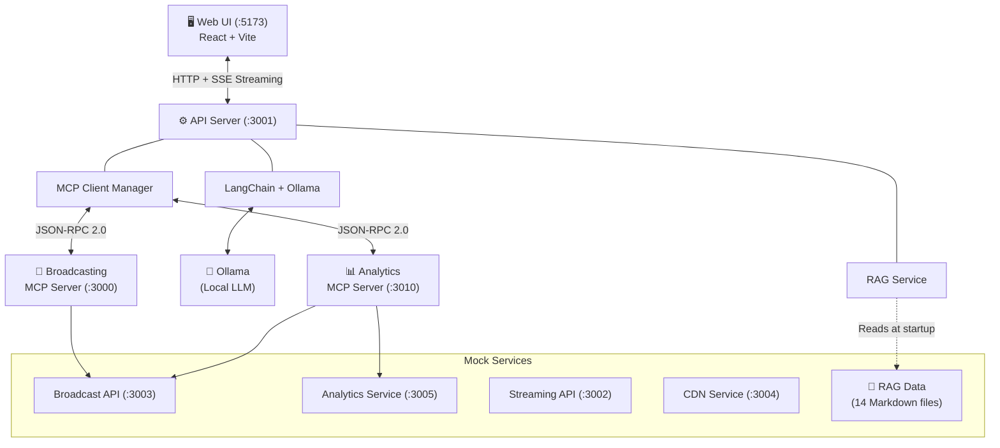

# Media Agent

An AI-powered assistant for **StreamVerse**, a media streaming and broadcasting platform. This project demonstrates a modern AI backend architecture integrating **MCP (Model Context Protocol)**, **LangChain**, **Ollama**, and **RAG (Retrieval-Augmented Generation)** into a cohesive, production-style system.

## Architecture



## Key Technologies

| Technology | Role | Description |
|---|---|---|
| **MCP** | Tool/Resource/Prompt Protocol | Open protocol (by Anthropic) standardizing how AI apps communicate with external data sources and tools. Acts as a "USB-C port for AI." |
| **LangChain** | LLM Orchestration | Framework for building LLM-powered applications. Handles tool binding, message history, streaming, and the ReAct agent loop. |
| **Ollama** | Local LLM Runtime | Runs open-source LLMs (Llama, Qwen, Mistral, etc.) locally. Zero API costs, full privacy, no rate limits. Also provides embedding models for RAG. |
| **RAG** | Knowledge Retrieval | Retrieval-Augmented Generation pipeline that grounds LLM responses in domain-specific knowledge from markdown documentation files. |

## Project Structure

```
media-agent/
├── apps/
│   ├── api/                    # Central API server — orchestrates MCP, RAG, and LLM
│   │   ├── langchain/          # LangChain + Ollama integration, ReAct agent loop
│   │   ├── mcp/                # MCP client, multi-server manager, tool routing
│   │   ├── rag/                # RAG pipeline (load → chunk → embed → store → retrieve)
│   │   └── types/              # Shared TypeScript types
│   ├── mcp-server/
│   │   ├── broadcasting-mcp/   # MCP server for broadcast operations (port 3000)
│   │   └── analytics_mcp/     # MCP server for analytics data (port 3010)
│   └── web/                    # React frontend with chat UI
├── mock-services/              # Simulated backend services
│   ├── broadcast-api/          # Broadcast data REST API (port 3003)
│   ├── analytics-service/      # Analytics data REST API (port 3005)
│   ├── streaming-api/          # Streaming service API (port 3002)
│   ├── cdn-service/            # CDN service API (port 3004)
│   ├── media-database/         # Mock media database (JSON)
│   └── rag-data/               # Knowledge base markdown files for RAG
└── package.json                # Workspace root with dev script
```

## MCP Capabilities

The system exposes three types of MCP capabilities across two domain servers:

### Tools (LLM-invoked)

| Tool | Server | Description |
|---|---|---|
| `list_broadcasts` | Broadcasting | Query broadcasts with optional status/channel filters |
| `broadcast_analytics` | Analytics | Fetch detailed analytics for a specific broadcast |

### Resources (User-attached context)

| Resource | URI | Server | Type |
|---|---|---|---|
| Active Broadcasts | `broadcasts://active` | Broadcasting | Static |
| Channels Overview | `analytics://channels/overview` | Analytics | Static |
| Broadcast Analytics | `analytics://broadcasts/{id}` | Analytics | Templated |

### Prompts (User-triggered workflows)

| Prompt | Server | Description |
|---|---|---|
| `draft_broadcast_report` | Broadcasting | Generates a comprehensive broadcast status report (instruction-based) |
| `analyze_broadcast_performance` | Analytics | Detailed performance analysis with pre-fetched data from 4 API endpoints |

## Chat Flow

When a user sends a message, the system follows this pipeline:

1. **User message** arrives at `POST /chat`
2. **RAG retrieval** — the message is embedded and matched against the knowledge base; relevant chunks are injected into the system prompt
3. **LangChain** receives the augmented conversation and sends it to **Ollama**
4. **ReAct loop** — if the LLM decides it needs external data, it emits tool calls:
   - LangChain validates arguments and routes the call through **McpClientManager**
   - The manager identifies which MCP server owns the tool and forwards the call
   - The MCP server executes the tool (e.g., fetching from the Broadcast API)
   - Results flow back as "observations" — the LLM reads them and decides its next action
5. **Streaming** — every chunk (thinking, tokens, tool calls, results) is streamed to the browser via **Server-Sent Events (SSE)**

## Prerequisites

- **Node.js** ≥ 18.0.0
- **pnpm** ≥ 8.0.0
- **Ollama** installed and running locally ([Install Ollama](https://ollama.com/download))

### Required Ollama Models

Pull the models before starting the application:

```sh
# Chat model (adjust based on your hardware — smaller models also work)
ollama pull gpt-oss:20b

# Embedding model for RAG
ollama pull nomic-embed-text
```

> **Note:** You can use any Ollama-compatible chat model by changing the `model` field in `apps/api/index.ts`. Smaller models like `llama3.2:3b` or `qwen2.5:7b` work well on machines with limited resources.

## Getting Started

### 1. Install Dependencies

```sh
pnpm install
```

### 2. Start Everything

The root `dev` script starts all services concurrently:

```sh
pnpm dev
```

This launches:

| Service | Port | Color |
|---|---|---|
| Web UI | 5173 | Blue |
| API Server | 3001 | Green |
| Broadcasting MCP Server | 3000 | Yellow |
| Analytics MCP Server | 3010 | Magenta |
| Mock Services (4 servers) | 3002–3005 | Cyan |

### 3. Open the UI

Navigate to [http://localhost:5173](http://localhost:5173) in your browser.

## Environment Variables

All services use sensible defaults. Override with environment variables if needed:

| Variable | Default | Description |
|---|---|---|
| `MCP_BROADCAST_URL` | `http://localhost:3000/mcp` | Broadcasting MCP server endpoint |
| `MCP_ANALYTICS_URL` | `http://localhost:3010/mcp` | Analytics MCP server endpoint |
| `BROADCAST_API_URL` | `http://localhost:3003` | Broadcast REST API base URL |
| `ANALYTICS_API_URL` | `http://localhost:3005` | Analytics REST API base URL |
| `BROADCASTING_MCP_PORT` | `3000` | Broadcasting MCP server port |
| `ANALYTICS_MCP_PORT` | `3010` | Analytics MCP server port |
| `RAG_ENABLED` | `true` | Enable/disable RAG pipeline |
| `RAG_TOP_K` | `5` | Number of RAG chunks to retrieve per query |
| `OLLAMA_EMBEDDING_MODEL` | `nomic-embed-text` | Ollama model for embeddings |

## Scripts

| Command | Description |
|---|---|
| `pnpm dev` | Start all services in development mode |
| `pnpm build` | Build all packages |
| `pnpm clean` | Remove all `node_modules` directories |

## Design Principles

- **Domain Separation** — Each MCP server owns its domain (broadcasting vs analytics). Teams can develop, deploy, and scale independently.
- **Unified Interface** — The `McpClientManager` aggregates tools, resources, and prompts from all servers into a flat list. The LLM doesn't know or care which server provides what.
- **Graceful Degradation** — If one MCP server is down, the others continue working. Failed tool calls return error content instead of crashing.
- **Local-First AI** — Ollama runs everything on your machine. No API keys, no cloud dependencies, no usage costs.
- **Streaming UX** — Every step of the AI pipeline (thinking, tokens, tool calls, results) streams in real-time to the browser via SSE.

## License

MIT