# API Server

The central orchestrator for the Media Agent platform. This Express server ties together three AI subsystems — **MCP** (tool/resource/prompt access), **RAG** (knowledge base retrieval), and **LangChain + Ollama** (LLM orchestration) — and exposes them to the web UI via a unified HTTP API.

## Architecture

```mermaid
flowchart TD
    subgraph API["⚙️ API Server (:3001)"]
        subgraph MCPModule["MCP Module"]
            McpClient["McpClient"]
            McpClientManager["McpClientManager"]
            ToolRouting["Tool Routing"]
        end
        subgraph RAGModule["RAG Module"]
            RagService["RagService"]
            VectorStore["VectorStore"]
            Embeddings["Embeddings"]
        end
        subgraph LCModule["LangChain Module"]
            ChatOllama["ChatOllama"]
            ReAct["ReAct Agent Loop"]
            ToolBinding["Tool Binding"]
        end
    end

    MCPModule <-->|"JSON-RPC 2.0"| MCPServers["📡 MCP Servers<br/>(broadcast, analytics)"]
    RAGModule -.->|"Reads at startup"| RAGData["📄 RAG Data<br/>(markdown files)"]
    LCModule <--> Ollama["🧠 Ollama<br/>(local LLM)"]
```



## Directory Structure

```
api/
├── index.ts                  # Express server, routes, chat endpoint, startup
├── langchain/
│   └── ollamaService.ts      # LangChain + Ollama integration, ReAct agent loop
├── mcp/
│   ├── McpClient.ts          # Single MCP server client (connect, tools, resources, prompts)
│   ├── McpClientManager.ts   # Multi-server orchestrator with tool routing cache
│   └── client.ts             # Barrel re-export (public API surface)
├── rag/
│   └── index.ts              # RAG pipeline: load → chunk → embed → store → retrieve
├── types/
│   └── chatTypes.ts          # Shared ChatMessage type definition
├── data/                     # Runtime data directory (e.g., vector store cache)
├── package.json
└── tsconfig.json
```

## How It Works

### Chat Pipeline

When a user sends a message to `POST /chat`, the following pipeline executes:

1. **RAG Retrieval** — The user's message is embedded into a vector and matched against the knowledge base using cosine similarity. The top-K most relevant document chunks are retrieved and injected into the system prompt.

2. **System Prompt Construction** — The base system prompt ("You are a helpful AI assistant for StreamVerse...") is augmented with RAG context if available.

3. **LangChain Streaming** — The full conversation history (system prompt + user/assistant messages) is passed to `streamChatCompletion()`, which:
   - Converts MCP tool definitions into LangChain `DynamicStructuredTool` instances
   - Binds them to the Ollama model via `model.bindTools()`
   - Enters the **ReAct agent loop**

4. **ReAct Loop** — The LLM generates a response. If it emits `tool_calls` instead of text:
   - LangChain validates the arguments against the tool's Zod schema
   - The call is routed through `McpClientManager` to the correct MCP server
   - The tool result flows back as a `ToolMessage` (the "observation")
   - The loop repeats — the LLM reads the observation and decides what to do next
   - This continues until the LLM produces a final text answer (max 10 iterations)

5. **SSE Streaming** — Every intermediate step is streamed to the browser in real-time via Server-Sent Events:
   - `thinking` — Chain-of-thought reasoning tokens
   - `token` — Content tokens for the final answer
   - `rag_context` — Retrieved knowledge base chunks
   - `tool_call` — Tool invocation notifications
   - `tool_result` — Tool execution results
   - `observation` — Formatted observation for the UI
   - `done` — Stream completion signal
   - `error` — Error notifications

### MCP Client Module

The `mcp/` directory handles communication with MCP servers:

- **`McpClient`** — Wraps the official MCP SDK Client for a single server connection. Manages the session lifecycle (connect → interact → disconnect) over Streamable HTTP transport (JSON-RPC 2.0 over HTTP POST + SSE).

- **`McpClientManager`** — Orchestrates multiple MCP server connections. Key features:
  - **Tool routing cache** — Maps tool names to server names for O(1) lookup. Falls back to searching all servers if a tool isn't cached.
  - **Capability aggregation** — Merges tools, prompts, and resources from all connected servers into unified lists.
  - **Resilient connections** — One server failing doesn't block others. The system degrades gracefully.
  - **Singleton pattern** — A single instance is shared across the entire API process.

### RAG Pipeline

The `rag/` module implements a 5-stage pipeline:

| Stage | Description | When |
|---|---|---|
| **Load** | Read `.md` files from `mock-services/rag-data/` | Startup |
| **Chunk** | Split documents into ~1000-character pieces with 200-character overlap using `RecursiveCharacterTextSplitter` | Startup |
| **Embed** | Convert chunks to vector embeddings using Ollama's `nomic-embed-text` model | Startup |
| **Store** | Save embeddings in an in-memory vector store (`MemoryVectorStore`) | Startup |
| **Retrieve** | Embed the user's query and find the closest chunks via cosine similarity | Per message |

Retrieved chunks are formatted and injected into the system prompt so the LLM can reference domain-specific knowledge (API docs, troubleshooting guides, pricing info, etc.) when generating responses.

### LangChain + Ollama Module

The `langchain/` directory handles LLM interaction:

- **Model creation** — Instantiates `ChatOllama` with the configured model, temperature, and tool bindings.
- **MCP → LangChain tool conversion** — MCP tool definitions (JSON Schema) are converted to Zod schemas and wrapped in `DynamicStructuredTool` instances. Each tool's `func` callback routes through `McpClientManager.callTool()`.
- **ReAct system prompt** — A system message instructs the model on how to use tools following the Thought → Action → Observation pattern.
- **Streaming generator** — `streamChatCompletion()` is an async generator that yields typed chunks as the model generates tokens, calls tools, and produces its final answer.

## API Routes

### Chat

| Method | Path | Description |
|---|---|---|
| `POST` | `/chat` | Send a message and receive a streaming SSE response |
| `GET` | `/messages` | Retrieve conversation history |
| `DELETE` | `/messages` | Clear conversation history |

### MCP Proxy

| Method | Path | Description |
|---|---|---|
| `GET` | `/mcp/tools` | List all tools from all connected MCP servers |
| `GET` | `/mcp/prompts` | List all prompts from all connected MCP servers |
| `POST` | `/mcp/prompts/:name` | Resolve a prompt template with arguments |
| `GET` | `/mcp/resources` | List all resources from all connected MCP servers |
| `POST` | `/mcp/resources/read` | Read a resource's content by URI |
| `GET` | `/mcp/status` | Connection status of all MCP servers |

### RAG

| Method | Path | Description |
|---|---|---|
| `GET` | `/rag/sources` | List all knowledge base sources with metadata |

### System

| Method | Path | Description |
|---|---|---|
| `GET` | `/health` | Health check |

## Configuration

Default configuration is defined in `index.ts`:

```typescript
// LLM settings
const DEFAULT_CONFIG = {
  systemPrompt: "You are a helpful AI assistant for StreamVerse...",
  temperature: 0.7,
  maxTokens: 4096,
  model: "gpt-oss:20b",
};

// RAG settings
const RAG_CONFIG = {
  enabled: true,            // Set RAG_ENABLED=false to disable
  embeddingModel: "nomic-embed-text",
  topK: 5,                  // Number of chunks to retrieve per query
};

// MCP server connections
const MCP_SERVERS = [
  { name: "broadcast",  url: "http://localhost:3000/mcp", enabled: true },
  { name: "analytics",  url: "http://localhost:3010/mcp", enabled: true },
];
```

## Startup Sequence

1. Express server starts on port `3001`
2. MCP client manager connects to all configured MCP servers (with retry logic — up to 10 attempts, 3-second delay between retries)
3. RAG service initializes: loads markdown files, chunks them, generates embeddings, and builds the vector store
4. Server is ready to accept chat requests

## Development

```sh
# Start in watch mode (auto-restarts on file changes)
pnpm dev

# Start without watch
pnpm start
```

## Dependencies

| Package | Purpose |
|---|---|
| `express` | HTTP server framework |
| `@modelcontextprotocol/sdk` | MCP client SDK (JSON-RPC, transport, types) |
| `@langchain/ollama` | LangChain ↔ Ollama integration |
| `@langchain/core` | LangChain core (messages, tools, documents) |
| `@langchain/classic` | MemoryVectorStore for RAG |
| `@langchain/textsplitters` | RecursiveCharacterTextSplitter for chunking |
| `langchain` | LangChain framework |
| `zod` | Schema validation (tool parameters, MCP schemas) |
| `cors` | Cross-origin support for web UI |