# MCP Servers

This directory contains the domain-specific MCP (Model Context Protocol) servers for the Media Agent platform. Each server owns a distinct domain and exposes tools, resources, and prompts relevant to that domain.

## Domain Separation Pattern


The multi-server architecture enables:

- **Independent ownership** — Each team (broadcasting, analytics) owns and maintains its own MCP server without cross-dependencies.
- **Independent deployment** — Servers can be deployed, scaled, and updated independently. A new version of the analytics server doesn't require changes to the broadcasting server.
- **Graceful degradation** — If one server goes down, the others continue functioning. The LLM loses access to that server's tools but can still use everything else.
- **Clean separation of concerns** — Broadcasting logic stays in the broadcasting server; analytics logic stays in the analytics server. No tangled code.

## Servers

### [Broadcasting MCP Server](./broadcasting-mcp/)

Owns broadcast operations — querying broadcasts, viewing live broadcast data, and generating broadcast reports.

| Capability | Type | Description |
|---|---|---|
| `list_broadcasts` | Tool | Query broadcasts with optional status/channel filters |
| `broadcasts://active` | Resource (Static) | Live-updating list of active broadcasts |
| `draft_broadcast_report` | Prompt | Comprehensive broadcast status report template |

**Port:** 3000
**Data source:** Broadcast REST API (`:3003`)

### [Analytics MCP Server](./analytics_mcp/)

Owns analytics data — viewer metrics, engagement, stream quality, and audience demographics.

| Capability | Type | Description |
|---|---|---|
| `broadcast_analytics` | Tool | Detailed analytics for a specific broadcast |
| `analytics://channels/overview` | Resource (Static) | Channel-level analytics summary |
| `analytics://broadcasts/{id}` | Resource (Templated) | Per-broadcast analytics with dynamic discovery |
| `analyze_broadcast_performance` | Prompt | Performance analysis with pre-fetched data from 4 endpoints |

**Port:** 3010
**Data sources:** Analytics REST API (`:3005`), Broadcast REST API (`:3003`)

## The Three MCP Capability Types

```mermaid
flowchart TD
    subgraph Tools["🔧 Tools"]
        T1["Who triggers: The LLM (autonomously, during the ReAct loop)"]
        T2["What it does: Fetches data or performs actions"]
        T3["Returns: Raw data (JSON, text)"]
        T4["Analogy: A POST/RPC endpoint the AI can call"]
    end

    subgraph Resources["📦 Resources"]
        R1["Who triggers: The user (via the attach menu in the UI)"]
        R2["What it does: Provides contextual data"]
        R3["Returns: Read-only data snapshots"]
        R4["Analogy: A GET endpoint for background context"]
    end

    subgraph Prompts["💬 Prompts"]
        P1["Who triggers: The user (via the attach menu in the UI)"]
        P2["What it does: Generates structured instructions for the LLM"]
        P3["Returns: Pre-built message arrays"]
        P4["Analogy: A workflow template that guides the AI"]
    end
```



## Shared Architecture

Both servers follow the same architectural pattern:

1. **Per-session server instances** — A fresh `McpServer` is created for each client session (not shared globally) to avoid concurrency issues.
2. **Streamable HTTP transport** — JSON-RPC 2.0 over HTTP POST for requests, with SSE for streaming responses and push notifications.
3. **Session management** — Sessions are identified by the `Mcp-Session-Id` header. The server maintains a transport registry and cleans up on disconnect.
4. **Modular capability registration** — Tools, resources, and prompts are registered in separate files (`tools/tools.ts`, `resources/resources.ts`, `prompts/prompts.ts`) and composed in `index.ts`.
5. **Express-based HTTP server** — Uses `createMcpExpressApp()` from the MCP SDK with CORS enabled for cross-origin API server connections.
6. **Graceful shutdown** — SIGINT/SIGTERM handlers close all active transports before stopping the HTTP server.

## Adding a New MCP Server

To add a third domain server (e.g., a billing server):

1. Create a new directory under `apps/mcp-server/` (e.g., `billing-mcp/`)
2. Copy the structure from an existing server (`index.ts`, `tools/`, `resources/`, `prompts/`, `package.json`)
3. Implement domain-specific capabilities
4. Register the new server in the API's `MCP_SERVERS` config array in `apps/api/index.ts`:

```typescript
const MCP_SERVERS: McpServerConfig[] = [
  { name: "broadcast",  url: "http://localhost:3000/mcp", enabled: true },
  { name: "analytics",  url: "http://localhost:3010/mcp", enabled: true },
  { name: "billing",    url: "http://localhost:3020/mcp", enabled: true },
];
```

5. Add the new server's dev command to the root `package.json`'s `dev` script
6. Add the package to `pnpm-workspace.yaml` if not already covered by the `apps/mcp-server/*` glob

The `McpClientManager` will automatically connect to the new server at startup, discover its tools, and make them available to the LLM — no changes needed in the LangChain layer or the web UI.