# Analytics MCP Server

An MCP (Model Context Protocol) server that exposes analytics-related capabilities to AI applications. This is the second domain-specific MCP server in the Media Agent platform — it owns viewer metrics, engagement data, stream quality, and audience demographics, while the [Broadcasting MCP Server](../broadcasting-mcp/) handles broadcast operations.

## Architecture

```mermaid
flowchart TD
    subgraph AnalyticsMCP["📊 Analytics MCP Server (:3010)"]
        direction LR
        Tools["🔧 Tools: broadcast_analytics"]
        Resources["📦 Resources: analytics://channels/overview (static)<br/>analytics://broadcasts/{id} (templated)"]
        Prompts["💬 Prompts: analyze_broadcast_performance"]
    end

    API["⚙️ API Server (:3001)<br/>(MCP Client)"] <-->|"JSON-RPC 2.0<br/>Streamable HTTP"| AnalyticsMCP
    AnalyticsMCP -->|"Fetches analytics"| AnalyticsAPI["🗄️ Analytics REST API (:3005)<br/>(mock service)"]
    AnalyticsMCP -->|"Discovers broadcasts"| BroadcastAPI["🗄️ Broadcast REST API (:3003)<br/>(mock service)"]
```



The analytics server fetches data from **two** mock services:

- **Analytics REST API** (`:3005`) — Viewer metrics, engagement rates, stream quality, demographics
- **Broadcast REST API** (`:3003`) — Broadcast metadata (used to discover broadcast IDs for templated resources)

## Directory Structure

```
analytics_mcp/
├── index.ts              # Server entry point, Express app, session management
├── tools/
│   └── tools.ts          # MCP tool registrations (broadcast_analytics)
├── resources/
│   └── resources.ts      # MCP resource registrations (static + templated)
├── prompts/
│   └── prompts.ts        # MCP prompt registrations (analyze_broadcast_performance)
└── package.json
```

## How It Differs From the Broadcasting Server

While both servers follow the same MCP architecture (see [Broadcasting MCP Server README](../broadcasting-mcp/README.md) for a detailed explanation of session lifecycle, transport, and JSON-RPC handling), the analytics server demonstrates several **advanced patterns**:

| Feature | Broadcasting Server | Analytics Server |
|---|---|---|
| Tool parameters | All optional (search/filter) | Required `broadcastId` (detail/lookup) |
| Resource types | Static only | Static **and** Templated |
| Prompt pattern | Instruction-only | **Data pre-fetching** |
| Data sources | 1 API | 2 APIs (analytics + broadcast) |
| Cross-service joins | No | Yes (resources combine data from both APIs) |

## Capabilities

### Tool: `broadcast_analytics`

Fetch detailed analytics for a specific broadcast. Unlike the broadcasting server's `list_broadcasts` (where all parameters are optional), this tool has a **required** parameter — the LLM must know which broadcast to analyze before calling it.

| Parameter | Type | Required | Description |
|---|---|---|---|
| `broadcastId` | `string` | **Yes** | The broadcast ID to fetch analytics for (e.g., `"br_001"`) |

**Typical ReAct workflow (multi-tool collaboration):**

The LLM often uses both servers' tools together in a single ReAct loop:


The `McpClientManager` in the API server routes the calls to the correct server transparently. The LLM has no awareness of which server owns which tool.

**Returns:** JSON with viewer counts, peak viewers, total views, watch time, engagement metrics, and more.

### Resource: `analytics://channels/overview` (Static)

A static resource that aggregates data from **both** the Broadcast API and Analytics API to produce a channel-level summary. This cross-service join demonstrates that resource handlers can combine data from multiple sources — something the LLM would need multiple tool calls to achieve on its own.

| Property | Value |
|---|---|
| URI | `analytics://channels/overview` |
| MIME Type | `application/json` |
| Type | Static (fixed URI, dynamic data) |

**What the handler does:**

1. Fetches all broadcasts from the Broadcast API
2. Groups them by channel and computes per-channel statistics (total broadcasts, live/scheduled/completed counts, total views, peak viewers)
3. Enriches each channel with analytics data from the Analytics API (current viewers, average peak viewers, total watch time)
4. Returns the combined overview as a single JSON document

This makes it ideal as an "attach and go" resource — the user attaches it in the UI and the LLM immediately has a full picture of all channels without making any tool calls.

### Resource: `analytics://broadcasts/{broadcastId}` (Templated)

A **templated resource** that demonstrates MCP's dynamic resource discovery. Unlike static resources (which have a fixed URI), templated resources use URI patterns with placeholders that the server expands into concrete URIs at discovery time.

| Property | Value |
|---|---|
| URI Template | `analytics://broadcasts/{broadcastId}` |
| MIME Type | `application/json` |
| Type | Templated (dynamic URI expansion) |

**How templated resources work:**


**Key details:**

- The `list` callback fetches broadcast IDs from the **Broadcast API** (port 3003)
- The `read` handler fetches analytics from the **Analytics API** (port 3005)
- This cross-service coordination is invisible to the MCP client
- The set of available resources changes dynamically as broadcasts are created or removed
- Equivalent to a parameterized REST endpoint: `GET /api/analytics/broadcasts/:id`

**Static vs Templated resources:**

| Static | Templated |
|---|---|
| Fixed URI (e.g., `analytics://channels/overview`) | URI pattern with placeholders (e.g., `analytics://broadcasts/{id}`) |
| One handler, always the same resource | One handler, many concrete resources |
| Client knows the URI upfront | Client discovers URIs via `list` callback |
| Good for singleton/aggregate data | Good for per-entity data |

### Prompt: `analyze_broadcast_performance`

A prompt template that generates a detailed performance analysis. This prompt demonstrates the **data pre-fetching** pattern — unlike the broadcasting server's instruction-only prompt, this one fetches data from **4 API endpoints in parallel** and embeds it directly into the prompt message.

| Parameter | Type | Required | Description |
|---|---|---|---|
| `broadcastId` | `string` | **Yes** | The broadcast ID to analyze (e.g., `"br_001"`) |

**Data pre-fetching flow:**

```mermaid
flowchart TD
    User["👤 User selects prompt<br/>provides broadcastId"] --> Handler["⚙️ Prompt Handler"]

    Handler -->|"Promise.all()"| Fetch1["/broadcasts/{id}<br/>Core viewer metrics"]
    Handler -->|"Promise.all()"| Fetch2["/broadcasts/{id}/engagement<br/>Chat, likes, shares"]
    Handler -->|"Promise.all()"| Fetch3["/broadcasts/{id}/quality<br/>Bitrate, buffering"]
    Handler -->|"Promise.all()"| Fetch4["/broadcasts/{id}/demographics<br/>Region, device"]

    Fetch1 --> Assembled["📋 Assembled Prompt"]
    Fetch2 --> Assembled
    Fetch3 --> Assembled
    Fetch4 --> Assembled

    Assembled -->|"Instructions + all data<br/>embedded in message"| LLM["🧠 LLM produces full analysis<br/>in a single generation pass<br/>(no tool calls needed)"]
```



**Report sections produced:**

1. **Overview** — Key metrics (current viewers, peak viewers, total views, duration)
2. **Engagement Analysis** — Engagement rate, chat activity, likes, shares
3. **Stream Quality Assessment** — Bitrate, buffering rate, startup time, quality rating
4. **Audience Demographics** — Breakdown by region, device, and platform
5. **Recommendations** — 3–5 actionable improvements

**Instruction-only vs Data pre-fetched patterns:**

| | Instruction-Only (broadcasting prompt) | Data Pre-Fetched (this prompt) |
|---|---|---|
| **Approach** | Returns instructions; LLM fetches data via tools in the ReAct loop | Fetches data at prompt resolution time; embeds all data in the message |
| **Speed** | Slower (multiple ReAct cycles) | Faster (single generation pass) |
| **Flexibility** | High — LLM can adapt queries dynamically | Lower — data is a snapshot taken at resolution time |
| **Reliability** | Tool calls may fail mid-loop | Guaranteed data availability (or clear error) |
| **Best for** | Exploratory queries, complex multi-step workflows | Known data requirements, predictable analysis tasks |

**Graceful error handling:**

Each of the 4 API endpoints is checked independently. If one fails (e.g., the demographics service is down), the prompt includes an error message for that section but still provides data from the others. The LLM can produce a partial analysis with whatever data is available.

## HTTP Endpoints

| Method | Path | Description |
|---|---|---|
| `POST` | `/mcp` | Main JSON-RPC endpoint — handles `initialize`, `tools/list`, `tools/call`, `prompts/list`, `prompts/get`, `resources/list`, `resources/read` |
| `GET` | `/mcp` | SSE stream for server-initiated push notifications |
| `DELETE` | `/mcp` | Session termination |
| `GET` | `/health` | Health check (reports active session count) |

## Configuration

| Variable | Default | Description |
|---|---|---|
| `ANALYTICS_MCP_PORT` | `3010` | Server port |
| `ANALYTICS_API_URL` | `http://localhost:3005` | Analytics REST API base URL |
| `BROADCAST_API_URL` | `http://localhost:3003` | Broadcast REST API base URL (used for resource discovery) |

## Development

```sh
# Start in watch mode (auto-restarts on file changes)
pnpm dev

# Start without watch
pnpm start
```

## Dependencies

| Package | Purpose |
|---|---|
| `@modelcontextprotocol/sdk` | MCP server SDK (McpServer, ResourceTemplate, transports, types) |
| `express` | HTTP server (via `createMcpExpressApp`) |
| `cors` | Cross-origin support for API server connections |
| `zod` | Schema validation for tool/prompt parameters |

## Adding New Capabilities

### Adding a new tool

1. Create a registration function in `tools/tools.ts`:

```typescript
function registerMyNewTool(server: McpServer) {
  server.registerTool(
    "my_tool_name",
    {
      description: "Description the LLM reads to decide when to call this tool",
      inputSchema: {
        requiredParam: z.string().describe("What this parameter does"),
        optionalParam: z.number().optional().describe("Optional parameter"),
      },
    },
    async ({ requiredParam, optionalParam }) => {
      const response = await fetch(`${ANALYTICS_API_URL}/api/...`);
      const data = await response.json();
      return {
        content: [{ type: "text", text: JSON.stringify(data, null, 2) }],
      };
    },
  );
}
```

2. Call it from `registerTools()`:

```typescript
export function registerTools(server: McpServer) {
  registerBroadcastAnalytics(server);
  registerMyNewTool(server);  // Add here
}
```

### Adding a new templated resource

```typescript
import { ResourceTemplate } from "@modelcontextprotocol/sdk/server/mcp.js";

server.registerResource(
  "my-resource",
  new ResourceTemplate("analytics://my-domain/{entityId}", {
    list: async () => {
      // Fetch available entities and return concrete URIs
      const entities = await fetchEntities();
      return {
        resources: entities.map(e => ({
          uri: `analytics://my-domain/${e.id}`,
          name: e.name,
          description: `Data for ${e.name}`,
        })),
      };
    },
  }),
  { description: "Per-entity analytics data" },
  async (uri, { entityId }) => {
    // entityId is extracted from the URI by the SDK
    const data = await fetchEntityData(entityId);
    return {
      contents: [{ uri: uri.href, mimeType: "application/json", text: JSON.stringify(data, null, 2) }],
    };
  },
);
```

### Adding a new prompt with data pre-fetching

Add a registration function in `prompts/prompts.ts`. Use `Promise.all()` to fetch data from multiple endpoints in parallel, then embed all data directly in the returned message. Handle per-endpoint errors gracefully so partial data still produces useful results.