# Broadcasting MCP Server

An MCP (Model Context Protocol) server that exposes broadcasting-related capabilities to AI applications. This server is one of two domain-specific MCP servers in the Media Agent platform — it owns everything related to broadcast operations, while the [Analytics MCP Server](../analytics_mcp/) handles viewer metrics and performance data.

## Architecture

```mermaid
flowchart TD
    subgraph BroadcastMCP["📡 Broadcasting MCP Server (:3000)"]
        direction LR
        Tools["🔧 Tools: list_broadcasts"]
        Resources["📦 Resources: broadcasts://active"]
        Prompts["💬 Prompts: draft_broadcast_report"]
    end

    API["⚙️ API Server (:3001)<br/>(MCP Client)"] <-->|"JSON-RPC 2.0<br/>Streamable HTTP"| BroadcastMCP
    BroadcastMCP -->|"Fetches data"| BroadcastAPI["🗄️ Broadcast REST API (:3003)<br/>(mock service)"]
```



## Directory Structure

```
broadcasting-mcp/
├── index.ts              # Server entry point, Express app, session management
├── tools/
│   └── tools.ts          # MCP tool registrations (list_broadcasts)
├── resources/
│   └── resources.ts      # MCP resource registrations (broadcasts://active)
├── prompts/
│   └── prompts.ts        # MCP prompt registrations (draft_broadcast_report)
└── package.json
```

## How MCP Servers Work

MCP servers expose three types of capabilities over a JSON-RPC 2.0 transport:

1. **Tools** — Functions the LLM can call autonomously during the ReAct agent loop
2. **Resources** — Read-only data endpoints the user can attach as context
3. **Prompts** — Reusable message templates the user selects to start workflows

### Session Lifecycle

Each client connection gets its own isolated session:


A new `McpServer` instance is created per session (not shared globally) to avoid concurrency issues and enable independent session state.

## Capabilities

### Tool: `list_broadcasts`

Query broadcast data from the Broadcast REST API with optional filters.

| Parameter | Type | Required | Description |
|---|---|---|---|
| `status` | `string` | No | Filter by status: `"live"`, `"scheduled"`, or `"completed"` |
| `channelId` | `string` | No | Filter by channel ID (e.g., `"ch_001"`) |

**Example calls:**

```json
// Get all broadcasts
{ "status": undefined, "channelId": undefined }

// Get only live broadcasts
{ "status": "live" }

// Get broadcasts for a specific channel
{ "channelId": "ch_001" }

// Combined filters
{ "status": "live", "channelId": "ch_001" }
```

**How it's used in the ReAct loop:**

The LLM reads the tool's description and decides when to call it. When the user asks "What broadcasts are currently live?", the LLM emits a `tool_call` with `{ "status": "live" }`. The tool handler fetches data from the Broadcast REST API (`GET http://localhost:3003/api/broadcasts?status=live`) and returns the JSON result. The LLM then reads this as an "observation" and formulates its answer.

### Resource: `broadcasts://active`

A static, read-only resource that returns all currently live broadcasts. Unlike tools (which the LLM calls autonomously), resources are selected by the **user** in the UI's attach menu and included as context in the next message.

| Property | Value |
|---|---|
| URI | `broadcasts://active` |
| MIME Type | `application/json` |
| Type | Static (fixed URI, dynamic data) |

The resource handler fetches live broadcasts from `GET http://localhost:3003/api/broadcasts?status=live` and returns the data as JSON content. The data changes over time as broadcasts start and end, but the URI is always the same.

**Resource vs Tool — when to use which:**

| Resources | Tools |
|---|---|
| Read-only data | Can read and write |
| Selected by the **user** | Called by the **LLM** |
| Attached as context | Invoked during ReAct loop |
| Identified by URI | Identified by name |
| "Here's some background data" | "Go fetch this specific thing" |

### Prompt: `draft_broadcast_report`

A reusable prompt template that generates a comprehensive broadcast status report. This prompt uses the **instruction-only** pattern — it returns detailed instructions that guide the LLM to call tools and produce structured output, rather than pre-fetching data itself.

| Parameter | Type | Required | Description |
|---|---|---|---|
| `channelId` | `string` | No | Scope the report to a specific channel |
| `status` | `"live" \| "scheduled" \| "completed"` | No | Filter by broadcast status |

**What the resolved prompt instructs the LLM to do:**

1. Call the `list_broadcasts` tool to gather data
2. Produce a Markdown report with these sections:
   - Executive Summary
   - Active Broadcasts
   - Scheduled Broadcasts
   - Recently Completed
   - Alerts & Issues
   - Recommendations

**Instruction-only vs Data pre-fetched patterns:**

This prompt uses the instruction-only approach (contrast with the analytics server's `analyze_broadcast_performance` prompt, which pre-fetches data from 4 API endpoints):

| Instruction-Only (this prompt) | Data Pre-Fetched (analytics prompt) |
|---|---|
| Returns instructions, LLM fetches data via tools | Fetches data at resolution time, embeds in message |
| Flexible — LLM can adapt queries | Fast — no ReAct loop needed |
| Multiple ReAct cycles | Single generation pass |
| Tool calls may fail | Data is a snapshot (may be stale) |

## HTTP Endpoints

| Method | Path | Description |
|---|---|---|
| `POST` | `/mcp` | Main JSON-RPC endpoint — handles `initialize`, `tools/list`, `tools/call`, `prompts/list`, `prompts/get`, `resources/list`, `resources/read` |
| `GET` | `/mcp` | SSE stream for server-initiated push notifications |
| `DELETE` | `/mcp` | Session termination |
| `GET` | `/health` | Health check (reports active session count) |

## Configuration

| Variable | Default | Description |
|---|---|---|
| `BROADCASTING_MCP_PORT` | `3000` | Server port |
| `BROADCAST_API_URL` | `http://localhost:3003` | Broadcast REST API base URL |

## Development

```sh
# Start in watch mode (auto-restarts on file changes)
pnpm dev

# Start without watch
pnpm start
```

## Dependencies

| Package | Purpose |
|---|---|
| `@modelcontextprotocol/sdk` | MCP server SDK (McpServer, transports, types) |
| `express` | HTTP server (via `createMcpExpressApp`) |
| `cors` | Cross-origin support for API server connections |
| `zod` | Schema validation for tool/prompt parameters |

## Adding New Capabilities

### Adding a new tool

1. Create a registration function in `tools/tools.ts`:

```typescript
function registerMyNewTool(server: McpServer) {
  server.registerTool(
    "my_tool_name",
    {
      description: "Description the LLM reads to decide when to call this tool",
      inputSchema: {
        param1: z.string().describe("What this parameter does"),
        param2: z.number().optional().describe("Optional parameter"),
      },
    },
    async ({ param1, param2 }) => {
      // Fetch data, perform action, etc.
      return {
        content: [{ type: "text", text: JSON.stringify(result, null, 2) }],
      };
    },
  );
}
```

2. Call it from `registerTools()`:

```typescript
export function registerTools(server: McpServer) {
  registerListBroadcastTool(server);
  registerMyNewTool(server);  // Add here
}
```

### Adding a new resource

Add a registration function in `resources/resources.ts` and call it from `registerResources()`. Use `server.registerResource()` for static resources or `ResourceTemplate` for templated resources.

### Adding a new prompt

Add a registration function in `prompts/prompts.ts` and call it from `registerPrompts()`. Use `server.registerPrompt()` with an args schema and a handler that returns a `messages` array.