# Web UI

The React frontend for the Media Agent platform. This single-page application provides a chat interface for interacting with the AI assistant, complete with real-time streaming, MCP capability browsing (tools, resources, prompts), RAG source attribution, and tool call visualization.

## Architecture

```mermaid
flowchart TD
    subgraph WebUI["🖥️ Web UI (:5173)"]
        subgraph App["App"]
            subgraph Chat["Chat"]
                ChatHeader["ChatHeader"]
                MessageList["MessageList"]
                ChatInput["ChatInput"]
                ConnectionsPanel["ConnectionsPanel"]
                ChatMessage["ChatMessage<br/>(per message)"]
                McpAttachMenu["McpAttachMenu<br/>(tools, resources, prompts)"]
                MarkdownContent["MarkdownContent"]
            end
        end
        useChat["Hook: useChat()<br/>manages messages, streaming, SSE parsing"]
    end

    ChatHeader --- ConnectionsPanel
    MessageList --- ChatMessage
    ChatMessage --- MarkdownContent
    ChatInput --- McpAttachMenu

    WebUI <-->|"HTTP + SSE Streaming"| API["⚙️ API Server (:3001)"]
```



## Directory Structure

```
web/
├── src/
│   ├── App.tsx                    # Root component (chat or markdown test mode)
│   ├── main.tsx                   # React entry point
│   ├── index.css                  # Global styles (Tailwind base)
│   ├── components/
│   │   ├── Chat.tsx               # Main chat layout — composes header, messages, input
│   │   ├── ChatHeader.tsx         # Top bar with title and connections panel toggle
│   │   ├── ChatInput.tsx          # Auto-resizing textarea with send button and attach menu
│   │   ├── ChatMessage.tsx        # Individual message bubble (user or assistant)
│   │   ├── ConnectionsPanel.tsx   # Sidebar showing MCP server connection status
│   │   ├── EmptyState.tsx         # Welcome screen shown when no messages exist
│   │   ├── McpAttachMenu.tsx      # Dropdown for browsing/attaching MCP tools, resources, prompts
│   │   ├── MessageList.tsx        # Scrollable message container with auto-scroll
│   │   ├── MarkdownContent.tsx    # Markdown renderer with syntax highlighting
│   │   ├── MarkdownContent.css    # Styles for rendered markdown and code blocks
│   │   ├── MarkdownTest.tsx       # Development test page for markdown rendering
│   │   └── ui/                    # Reusable UI primitives (shadcn/ui style)
│   ├── hooks/
│   │   └── useChat.ts             # Core chat hook — state, streaming, SSE parsing
│   ├── lib/
│   │   └── utils.ts               # Utility functions (cn, classnames merging)
│   └── types/
│       └── chat.ts                # TypeScript types (Message, ToolCall, RagSource, SSEEvent)
├── public/                        # Static assets
├── index.html                     # HTML entry point
├── vite.config.ts                 # Vite configuration
├── tailwind.config.js             # Tailwind CSS configuration
├── postcss.config.js              # PostCSS configuration
├── tsconfig.json                  # Root TypeScript config
├── tsconfig.app.json              # App-specific TypeScript config
├── tsconfig.node.json             # Node/tooling TypeScript config
├── eslint.config.js               # ESLint configuration
└── package.json
```

## Key Components

### `Chat`

The top-level layout component that composes the entire chat interface. It wires together the `useChat()` hook with the header, message list, and input components, and manages the visibility of the connections panel sidebar.

### `ChatInput`

A flexible, auto-resizing textarea with integrated controls:

- **Auto-resize** — The input grows vertically as the user types multi-line messages, up to a configurable maximum height
- **Send button** — Submits the current message (also triggered by Enter; Shift+Enter for new lines)
- **Attach menu** — Opens the `McpAttachMenu` dropdown for browsing MCP capabilities
- **Attached resources** — Displays badges for any resources the user has attached, with the ability to remove them before sending

### `ChatMessage`

Renders a single message bubble with rich content:

- **User messages** — Plain text with optional attached resource badges
- **Assistant messages** — Markdown-rendered content with:
  - **Thinking** — Expandable chain-of-thought reasoning section (if the model supports it)
  - **Tool calls** — Visual indicators showing which MCP tools were called, with expandable results
  - **RAG sources** — Attribution badges showing which knowledge base documents contributed to the answer
  - **Streaming indicator** — Animated cursor during active streaming

### `McpAttachMenu`

A dropdown menu that lets users browse and interact with MCP capabilities from all connected servers:

- **Tools** — View available tools and their descriptions
- **Resources** — Browse resources, read their content, and attach them as context to the next message
- **Prompts** — Select prompt templates, fill in arguments, and inject the resolved prompt text into the chat input

Resources are fetched from the API's `/mcp/resources/read` endpoint when the user selects one, and the content is attached to the next message as context the LLM can reference.

### `ConnectionsPanel`

A sidebar panel showing the connection status of all MCP servers. Displays each server's name, URL, connection state (connected/disconnected), and session ID. Useful for debugging connectivity issues.

### `MarkdownContent`

A Markdown renderer built with `react-markdown` and enhanced with:

- **GitHub Flavored Markdown** (`remark-gfm`) — Tables, strikethrough, task lists
- **Line breaks** (`remark-breaks`) — Newlines become `<br>` tags
- **Syntax highlighting** (`rehype-highlight` + `highlight.js`) — Code blocks with language-specific coloring
- **Raw HTML** (`rehype-raw`) — Inline HTML passthrough

### `EmptyState`

A welcome screen displayed when the conversation is empty. Shows the assistant's name, a brief description, and suggested starter messages the user can click to begin a conversation.

## Core Hook: `useChat()`

The `useChat()` hook in `hooks/useChat.ts` is the heart of the frontend. It manages:

### State

| State | Type | Description |
|---|---|---|
| `messages` | `Message[]` | All messages in the conversation |
| `input` | `string` | Current text in the input field |
| `isLoading` | `boolean` | Whether a response is currently streaming |
| `attachedResources` | `AttachedResource[]` | Resources attached to the next message |

### SSE Streaming

When the user sends a message, the hook:

1. Creates a user message and a placeholder assistant message
2. Sends a `POST /chat` request to the API server
3. Reads the response body as a stream using `ReadableStream` + `TextDecoder`
4. Parses Server-Sent Events from the raw text stream
5. Updates the assistant message progressively as events arrive

### SSE Event Types

| Event | Data | Description |
|---|---|---|
| `thinking` | `{ token, thinkingType }` | Chain-of-thought reasoning token. `thinkingType` is either `"llm_reasoning"` or `"system_message"` |
| `token` | `{ token }` | Content token for the assistant's response |
| `tool_call` | `{ toolName, message }` | Notification that the LLM is calling an MCP tool |
| `tool_result` | `{ toolName, result }` | Result from an MCP tool execution |
| `observation` | `{ toolName, content }` | Formatted observation sent back to the LLM |
| `rag_context` | `{ chunks, chunkCount }` | Retrieved knowledge base chunks used for this response |
| `done` | `{}` | Stream completed successfully |
| `error` | `{ message }` | An error occurred during processing |

### Exposed API

```typescript
const {
  messages,              // Message[]
  input,                 // string
  setInput,              // (value: string) => void
  isLoading,             // boolean
  sendMessage,           // () => Promise<void>
  clearChat,             // () => Promise<void>
  attachedResources,     // AttachedResource[]
  addAttachedResource,   // (resource: AttachedResource) => void
  removeAttachedResource,// (uri: string) => void
  handleUsePrompt,       // (promptText: string) => void
} = useChat();
```

## Types

Defined in `types/chat.ts`:

### `Message`

```typescript
interface Message {
  id: string;
  role: "user" | "assistant";
  content: string;
  thinking?: string;           // LLM chain-of-thought reasoning
  thinkingSystem?: string;     // System-level thinking
  isStreaming?: boolean;        // True while response is being streamed
  toolCalls?: ToolCall[];       // MCP tools called during this response
  ragSources?: RagSource[];     // Knowledge base chunks used
  attachedResources?: AttachedResourceInfo[];  // Resources user attached
}
```

### `ToolCall`

```typescript
interface ToolCall {
  id: string;
  name: string;                // MCP tool name (e.g., "list_broadcasts")
  message?: string;            // Human-readable call description
  result?: string;             // Tool execution result
  observation?: string;        // Formatted observation for the LLM
}
```

### `RagSource`

```typescript
interface RagSource {
  source: string;              // Source document filename
  section?: string;            // Section within the document
  score: number;               // Similarity score (0–1)
  preview?: string;            // Text preview of the chunk
}
```

## API Communication

The web UI communicates with the API server at `http://127.0.0.1:3001`. All API interactions:

| Action | Method | Endpoint | Description |
|---|---|---|---|
| Send message | `POST` | `/chat` | Send a message, receive SSE stream |
| Get history | `GET` | `/messages` | Retrieve conversation history |
| Clear history | `DELETE` | `/messages` | Clear all messages |
| List tools | `GET` | `/mcp/tools` | Fetch available MCP tools |
| List prompts | `GET` | `/mcp/prompts` | Fetch available MCP prompts |
| Resolve prompt | `POST` | `/mcp/prompts/:name` | Resolve a prompt template |
| List resources | `GET` | `/mcp/resources` | Fetch available MCP resources |
| Read resource | `POST` | `/mcp/resources/read` | Read a resource's content by URI |
| MCP status | `GET` | `/mcp/status` | Get MCP server connection status |

## Tech Stack

| Technology | Purpose |
|---|---|
| **React 19** | UI framework |
| **TypeScript** | Type safety |
| **Vite 7** | Dev server and bundler (with SWC for Fast Refresh) |
| **Tailwind CSS 3** | Utility-first styling |
| **Framer Motion** | Animations (message transitions, loading states) |
| **react-markdown** | Markdown rendering |
| **rehype-highlight** | Syntax highlighting for code blocks |
| **highlight.js** | Language-specific code coloring |
| **remark-gfm** | GitHub Flavored Markdown support |
| **Radix UI** | Accessible UI primitives (scroll area, slot) |
| **Lucide React** | Icon library |
| **class-variance-authority** | Component variant management |
| **clsx + tailwind-merge** | Conditional classname merging |

## Development

```sh
# Start dev server with hot reload
pnpm dev

# Build for production
pnpm build

# Preview production build
pnpm preview

# Run ESLint
pnpm lint
```

### Markdown Test Mode

Append `?test` to the URL to render the `MarkdownTest` component instead of the chat UI. This is useful for testing markdown rendering and syntax highlighting in isolation:

```
http://localhost:5173?test
```

## Configuration

The API URL is hardcoded in `hooks/useChat.ts`:

```typescript
const API_URL = "http://127.0.0.1:3001";
```

To point at a different API server, update this constant. In a production setup, this would typically be read from an environment variable via Vite's `import.meta.env`.

## Build Output

Production builds are output to the `dist/` directory by Vite. The build process:

1. TypeScript compilation (`tsc -b`)
2. Vite bundling with SWC-based React transform
3. Static assets output to `dist/`

The resulting files can be served by any static file server.