# Mock Services

Simulated backend services that provide realistic data for the Media Agent platform. These services act as the "real" APIs that the MCP servers and RAG pipeline interact with, enabling end-to-end development and testing without requiring actual broadcasting infrastructure.

## Architecture


## Directory Structure

```
mock-services/
├── streaming-api/
│   └── server.ts          # Streaming service REST API (port 3002)
├── broadcast-api/
│   └── server.ts          # Broadcast data REST API (port 3003)
├── cdn-service/
│   └── server.ts          # CDN service REST API (port 3004)
├── analytics-service/
│   └── server.ts          # Analytics data REST API (port 3005)
├── media-database/
│   └── db.json            # Shared mock media database
├── rag-data/              # Knowledge base markdown files for RAG
│   ├── streaming-api.md
│   ├── broadcast-api.md
│   ├── analytics-service.md
│   ├── cdn-service.md
│   ├── data-models.md
│   ├── streaming-concepts.md
│   ├── workflows.md
│   ├── troubleshooting.md
│   ├── company-info.md
│   ├── pricing-plans.md
│   ├── policies-guidelines.md
│   ├── support-contacts.md
│   ├── creators-partners.md
│   └── faqs.md
├── package.json
└── tsconfig.json
```

## Services

### Streaming API (`:3002`)

Simulates a streaming service that manages live video streams. Provides endpoints for stream metadata, status, and configuration.

**Consumed by:** Direct API access (not currently proxied through MCP, available for future expansion).

### Broadcast API (`:3003`)

The primary data source for broadcast operations. Stores and serves broadcast metadata including titles, channels, statuses, viewer counts, schedules, and stream configuration.

**Consumed by:**

- **Broadcasting MCP Server** — The `list_broadcasts` tool and `broadcasts://active` resource fetch data from this API
- **Analytics MCP Server** — The `analytics://broadcasts/{id}` templated resource uses this API to discover available broadcast IDs via its `list` callback
- **Analytics MCP Server** — The `analytics://channels/overview` static resource fetches broadcast data to compute per-channel statistics

**Key endpoints:**

| Method | Path | Description |
|---|---|---|
| `GET` | `/api/broadcasts` | List all broadcasts (supports `?status=` and `?channelId=` query filters) |
| `GET` | `/api/broadcasts/:id` | Get a specific broadcast by ID |

### CDN Service (`:3004`)

Simulates a content delivery network service that manages media distribution, edge server configuration, and caching.

**Consumed by:** Direct API access (not currently proxied through MCP, available for future expansion).

### Analytics Service (`:3005`)

Provides detailed analytics data including viewer metrics, engagement rates, stream quality statistics, and audience demographics. Supports both per-broadcast and per-channel analytics.

**Consumed by:**

- **Analytics MCP Server** — The `broadcast_analytics` tool fetches per-broadcast analytics from this API
- **Analytics MCP Server** — The `analyze_broadcast_performance` prompt pre-fetches data from 4 endpoints on this service
- **Analytics MCP Server** — The `analytics://channels/overview` resource enriches channel data with viewer and watch time metrics
- **Analytics MCP Server** — The `analytics://broadcasts/{id}` templated resource reads per-broadcast analytics

**Key endpoints:**

| Method | Path | Description |
|---|---|---|
| `GET` | `/api/analytics/broadcasts/:id` | Core analytics for a specific broadcast |
| `GET` | `/api/analytics/broadcasts/:id/engagement` | Engagement metrics (chat activity, likes, shares) |
| `GET` | `/api/analytics/broadcasts/:id/quality` | Stream quality metrics (bitrate, buffering, startup time) |
| `GET` | `/api/analytics/broadcasts/:id/demographics` | Audience demographics (region, device, platform) |
| `GET` | `/api/analytics/channels/:id` | Channel-level analytics summary |

### Media Database

A shared JSON file (`media-database/db.json`) that serves as the backing store for the mock services. Contains pre-seeded broadcast, channel, and media data.

## RAG Data

The `rag-data/` directory contains 14 markdown files that form the knowledge base for the RAG (Retrieval-Augmented Generation) pipeline. At startup, the API server's RAG service reads these files, splits them into chunks, generates vector embeddings using Ollama's `nomic-embed-text` model, and stores them in an in-memory vector store.

When a user sends a message, the RAG pipeline embeds the query, finds the most semantically similar chunks, and injects them into the system prompt so the LLM can reference domain-specific knowledge.

### Knowledge Base Files

| File | Category | Description |
|---|---|---|
| `streaming-api.md` | API Documentation | Streaming API endpoints, authentication, and usage |
| `broadcast-api.md` | API Documentation | Broadcast API endpoints, data models, and workflows |
| `analytics-service.md` | API Documentation | Analytics service endpoints and metrics definitions |
| `cdn-service.md` | API Documentation | CDN configuration, edge servers, and caching policies |
| `data-models.md` | Technical Reference | Data models and schemas used across services |
| `streaming-concepts.md` | Technical Reference | Streaming technology concepts (codecs, protocols, ABR) |
| `workflows.md` | Technical Reference | Common operational workflows and procedures |
| `troubleshooting.md` | Support | Common issues, error codes, and resolution steps |
| `company-info.md` | Business | StreamVerse company information and history |
| `pricing-plans.md` | Business | Subscription tiers, features, and pricing |
| `policies-guidelines.md` | Business | Content policies, community guidelines, and ToS |
| `support-contacts.md` | Support | Support channels, escalation paths, and SLAs |
| `creators-partners.md` | Business | Creator programs, partner integrations, and monetization |
| `faqs.md` | Support | Frequently asked questions and answers |

### How RAG Uses These Files

```mermaid
flowchart LR
    subgraph Startup["Startup (one-time indexing)"]
        direction LR
        Load["1. LOAD<br/>Read all 14 .md files<br/>from rag-data/"] --> Chunk["2. CHUNK<br/>Split into ~1000-char<br/>pieces (200-char overlap)"]
        Chunk --> Embed["3. EMBED<br/>Convert each chunk to<br/>a vector using<br/>nomic-embed-text"]
        Embed --> Store["4. STORE<br/>Save vectors in<br/>MemoryVectorStore"]
    end

    subgraph PerMessage["Per message (retrieval)"]
        Retrieve["5. RETRIEVE<br/>Embed user's query,<br/>find top-K nearest chunks"]
    end

    Store -.-> Retrieve
    Retrieve -->|"Inject matching chunks<br/>into the system prompt"| LLM["🧠 LLM references them<br/>when generating its answer"]
```



The RAG pipeline classifies each file by its name (e.g., `streaming-api.md` → `"streaming-api"`, `troubleshooting.md` → `"troubleshooting"`) and includes this classification in the chunk metadata. This enables the LLM to attribute information to specific sources in its responses.

## Running

All four services start together using a single command:

```sh
# Start all mock services concurrently
pnpm dev
```

This runs the `streaming`, `broadcast`, `analytics`, and `cdn` scripts in parallel using `concurrently`.

Individual services can also be started independently:

```sh
# Start individual services
pnpm run streaming    # Streaming API on port 3002
pnpm run broadcast    # Broadcast API on port 3003
pnpm run cdn          # CDN Service on port 3004
pnpm run analytics    # Analytics Service on port 3005
```

> **Note:** When running from the workspace root (`pnpm dev`), all mock services are started automatically alongside the API server, MCP servers, and web UI.

## Dependencies

| Package | Purpose |
|---|---|
| `express` | HTTP server framework for all mock services |
| `cors` | Cross-origin support (MCP servers run on different ports) |
| `tsx` | TypeScript execution without compilation |
| `concurrently` | Run multiple services in parallel |

## Adding New Mock Data

### Adding a new RAG document

1. Create a new `.md` file in `rag-data/` with a descriptive filename (e.g., `new-topic.md`)
2. Structure the content with Markdown headings (`#`, `##`, `###`) — the chunker uses these as natural split boundaries
3. Restart the API server — the RAG service will automatically pick up the new file, chunk it, embed it, and add it to the vector store

The filename is used to classify the document type. To add a human-readable label, update the `typeMap` in `apps/api/rag/index.ts`.

### Adding new API endpoints

1. Edit the relevant service's `server.ts` file (e.g., `broadcast-api/server.ts`)
2. Add new Express routes with realistic mock data
3. If the new endpoints should be accessible to the LLM, register corresponding MCP tools or resources in the appropriate MCP server

### Modifying seed data

Edit `media-database/db.json` to change the pre-seeded data used by the mock services. The services read from this file at startup (or on each request, depending on the service implementation).